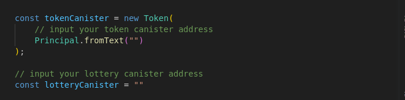
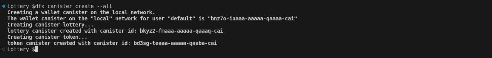
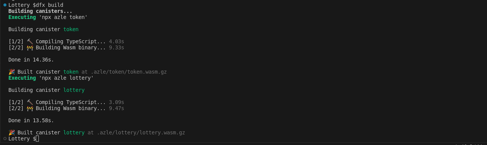
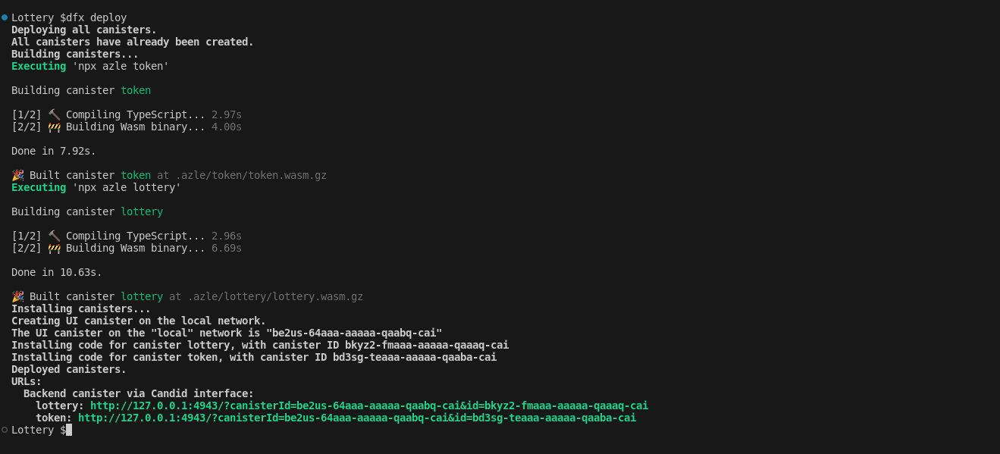
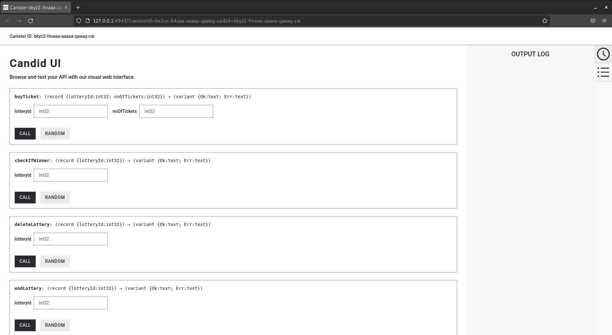
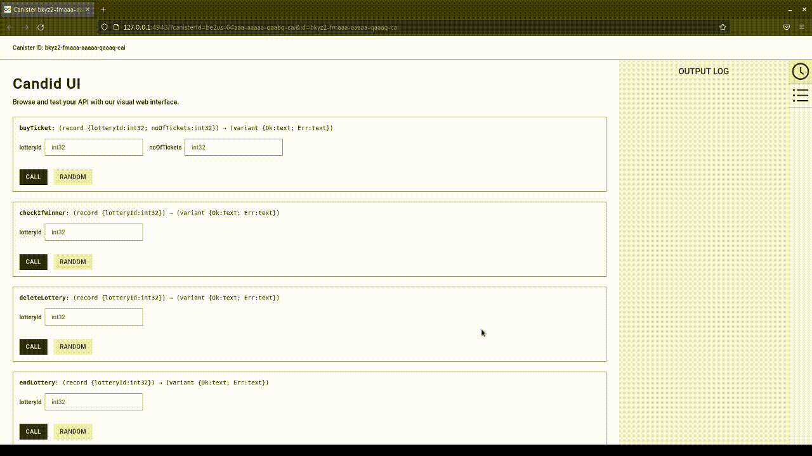
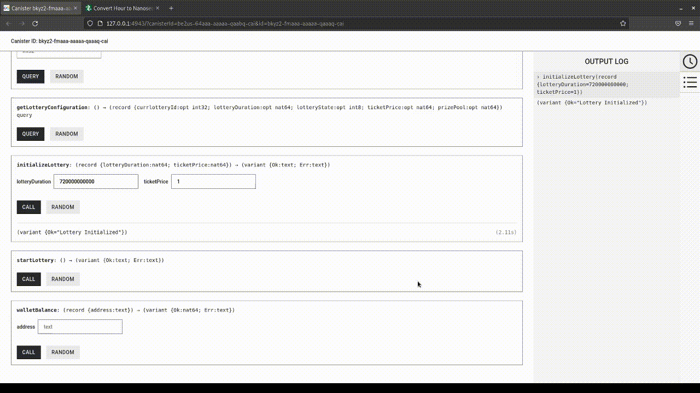
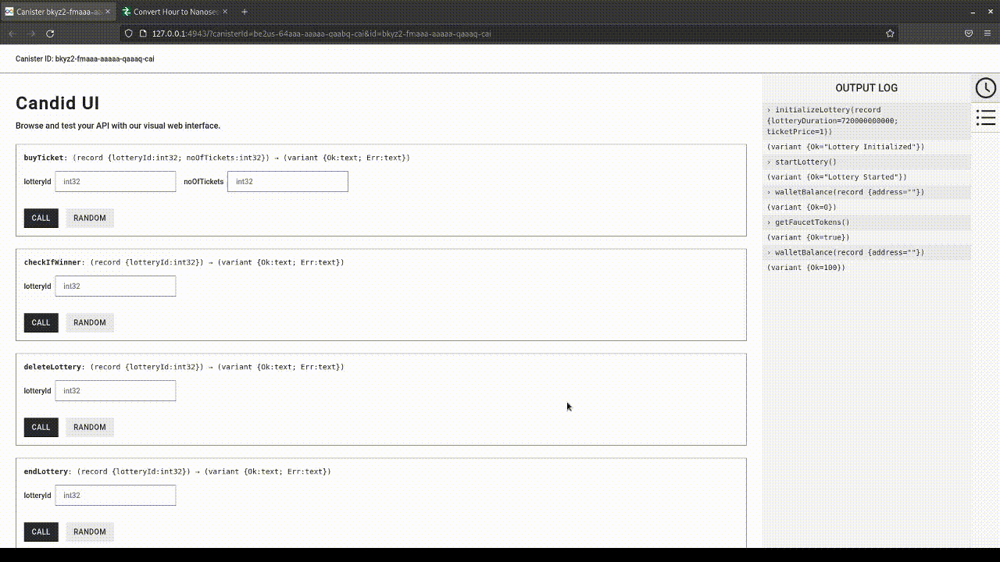
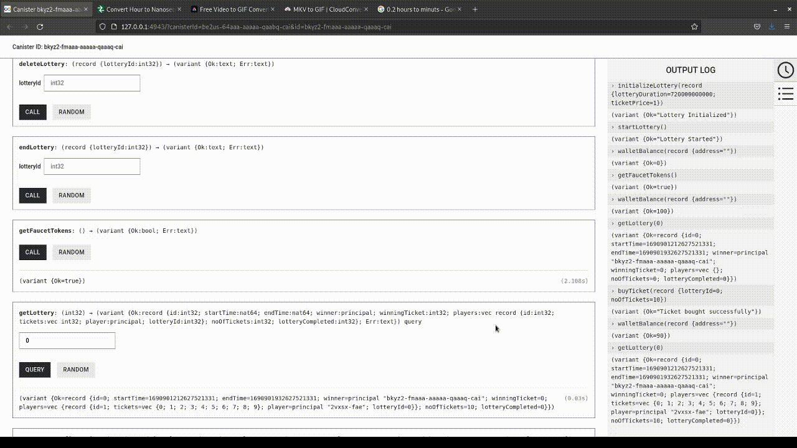
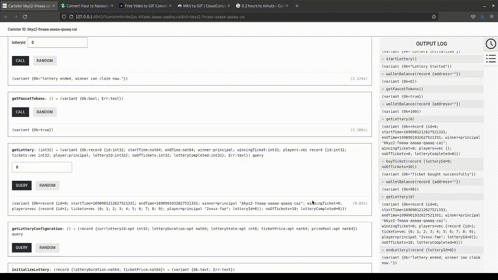

# Lottery

Simple lottery caninster built on the ICP network

## To Test

- Start the Local Internet Computer

    ```bash
    dfx start --background --clean
    ```

- Next you need to enter the tokenCanister and the lotteryCanister addresses
    

    Link to [tokenCanister](https://github.com/JoE11-y/Lottery-Canister/blob/main/src/lotteryCanister/index.ts#L8C27-L8C27)

    Linkt to [lotteryCanister](https://github.com/JoE11-y/Lottery-Canister/blob/main/src/lotteryCanister/index.ts#L12)

- You generate this addresses by running the create canister command

    ```bash
    dfx canister create --all
    ```

    

- Update the token canister and the lottery canister with the addresses gotten from the terminal
  
- Then run the build command to check that everything is working.

    ```bash
    dfx build
    ```

    

- Next we deploy the canister

    ```bash
    dfx deploy
    ```

    

- We only need the Candid interface for the lottery canister.

    `http://127.0.0.1:4943/?canisterId=<userAddress>&id=<lotteryCanisterAddress>`

- Copy yours from the output on the terminal

- Open on your webpage

    
  
- Initialize lottery with the duration in nanoseconds and the ticket price you want

    
  
- Next step is to start the lottery

   

To buy tickets you'll need the dummy tokens from the faucet, you can only get 100 tokens at a time.

- So use the `getFaucetTokens` function to get the dummy tokens

   

- Then buy the no of tickets you need using `buyTicket` function

    

- Wait for lottery duration to run out, then end the lottery which selects the winning ticket

   

- Then check if you're winner with the `checkIfWinner` function, which pays out dummy token into your balance.

   